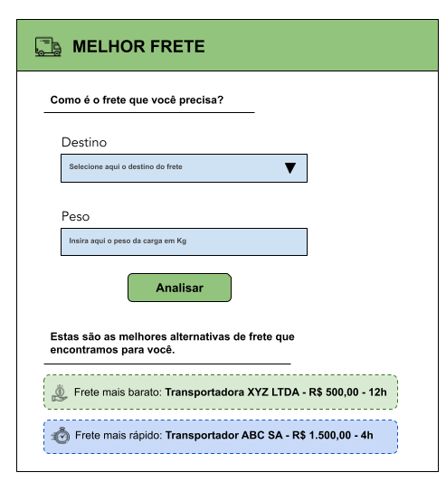

# Desafio Coordene
Olá DEV, pronto para participar do nosso processo seletivo?

## Requisitos
- Noções de programação web
- Javascript
- HTML

## Desafio
Uma empresa sediada em Campinas, precisa de ajuda para descobrir qual a melhor opção de transportadora, dependendo da cidade e do prazo de entrega. O time de logística registra todas as cotações dos fretes no ERP da empresa, por sorte este ERP tem uma API REST que fornece todos os dados de cotação de frete coletados, da seguinte forma:

```
$ curl -i -H "Accept: application/json" -H "Content-Type: application/json" -X GET  http://localhost:3000/transport

[
  {
    "id": 1,                                   <--- ID da cotação
    "name": "Expresso Oriente",                <--- Nome da transportadora
    "cost_transport_light": "R$ 2.10",         <--- Custo de Frete até 100Kg [R$/Kg]
    "cost_transport_heavy": "R$ 1.50",         <--- Custo de Frete mais de 100Kg [R$/Kg]
    "city": "São Paulo",                       <--- Cidade de destino
    "lead_time": "12h"                         <--- Tempo de entrega
  },
]
```

Implemente uma aplicação usando Vue e Javascript, com base nos requisitos descritos na historia a seguir:

**COMO** analista de logística.<br/>
**EU QUERO** saber qual é o preço do frete mais barato e qual o preço do frete mais rápido.<br/>
**PARA** tomar melhores decisões durante a contratação do frete.<br/>
<br/>
**DADO** que eu estou na pagina de análise de frete.<br/>
**QUANDO** eu inserir o peso do frete.<br/>
**E** a cidade de destino.<br/>
**E** clicar em "Analisar".<br/>
**ENTÃO** será exibido o nome da transportadora, o custo total e o tempo de entrega do frete mais barato.<br/>
**E** será exibido o nome da transportadora, o custo total e o tempo de entrega do frete mais rápido.<br/>



### Instruções para implementação

Para facilitar a resolução do desafio, deixamos uma parte do projeto já montado para você. No diretório "code" deste repositório você terá o esqueleto do projeto já montado.

Utilize os seguintes comandos para rodar a página do desafio.

```
cd code

npm install

npm run serve
```
Você também vai precisar ligar o servidor da API REST para consultar as cotações dos fretes, utilize o seguinte comando para isso:

```
npm run api_serve

```

Para testar a api, você pode usar o seguinte comando:
```
curl -i -H "Accept: application/json" -H "Content-Type: application/json" -X GET  http://localhost:3000/transport
```

Ele ira retornar uma lista com os valores das cotações, como  exemplo a seguir:
```
$ curl -i -H "Accept: application/json" -H "Content-Type: application/json" -X GET  http://localhost:3000/transport

HTTP/1.1 200 OK
X-Powered-By: Express
Vary: Origin, Accept-Encoding
Access-Control-Allow-Credentials: true
Cache-Control: no-cache
Pragma: no-cache
Expires: -1
X-Content-Type-Options: nosniff
Content-Type: application/json; charset=utf-8
Content-Length: 2837
ETag: W/"b15-f90GSZPs+txwiOzSSKLWg7LqzzE"
Date: Wed, 27 Apr 2022 23:55:34 GMT
Connection: keep-alive
Keep-Alive: timeout=5

[
  {
    "id": 1,
    "name": "Expresso Oriente",
    "cost_transport_light": "R$ 2.10",
    "cost_transport_heavy": "R$ 1.50",
    "city": "São Paulo",
    "lead_time": "12h"
  },
  {
    "id": 2,
    "name": "Expresso Oriente",
    "cost_transport_light": "R$ 4.20",
    "cost_transport_heavy": "R$ 3.10",
    "city": "Belo Horizonte",
    "lead_time": "18h"
  },
]
```

## Avaliação
O que vamos avaliar:
- Atenção aos requisitos do projeto.
- Atenção as instruções que fornecemos.
- Lógica.
- Qualidade.
- Manutenabilidade.
- Organização.
- Boas práticas.

## Instruções
Siga os seguintes passos para a execução do desafio:
1. Crie um repositório **público** no GitHub.
2. Faça o **clone** do repositório que você acabou de criar.
3. Extraia os arquivos do "desafio_coordene.zip" na pasta que você fez o clone do repostório.
4. Faça o primeiro **commit** com apenas estes arquivos no seu repositório, desta forma fica mais simples avaliar o que você implementou.
5. Implemente o desafio.
6. Faça o **commit** da sua implementação, inclusive se você quiser criar um commit diferente para cada parte que você implementou, é uma pratica que gostamos muito aqui na Coordene.
7. Faça o **push** das suas alterações.
8. Após concluir os passos anteriores, preencha este [formulário](https://airtable.com/shrVudPoyEvmXUyLs).

### Importante
- Não se esqueça de deixar o seu ***repositório público*** para que possamos revisar o seu código.
